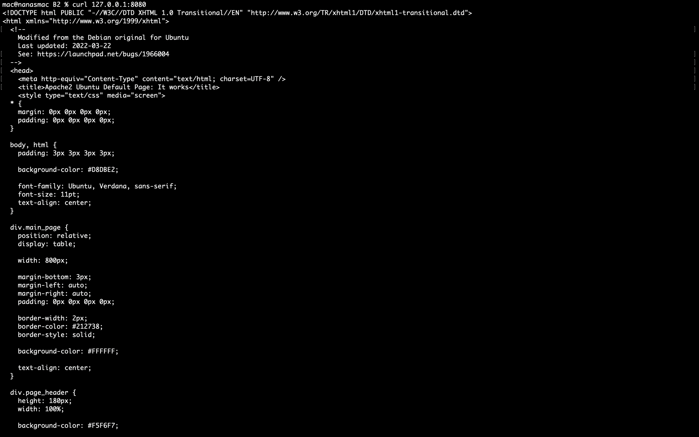
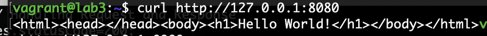
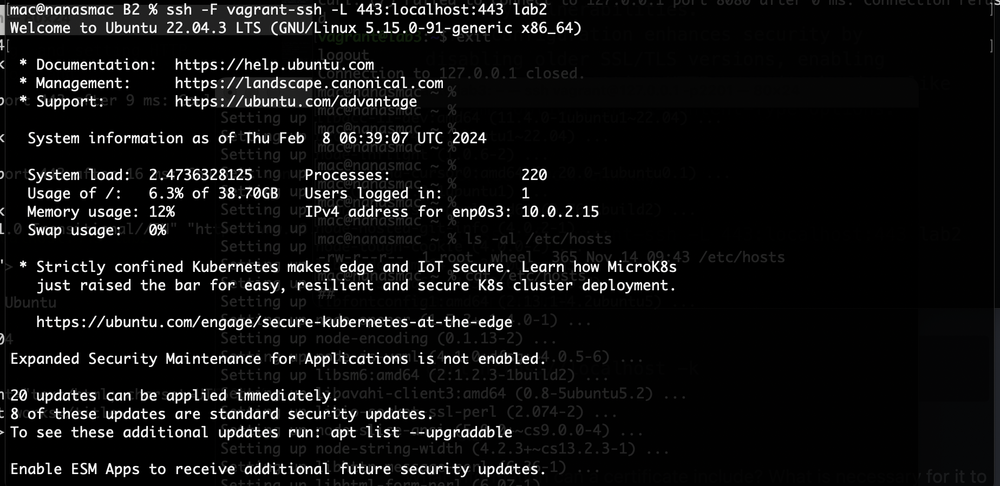
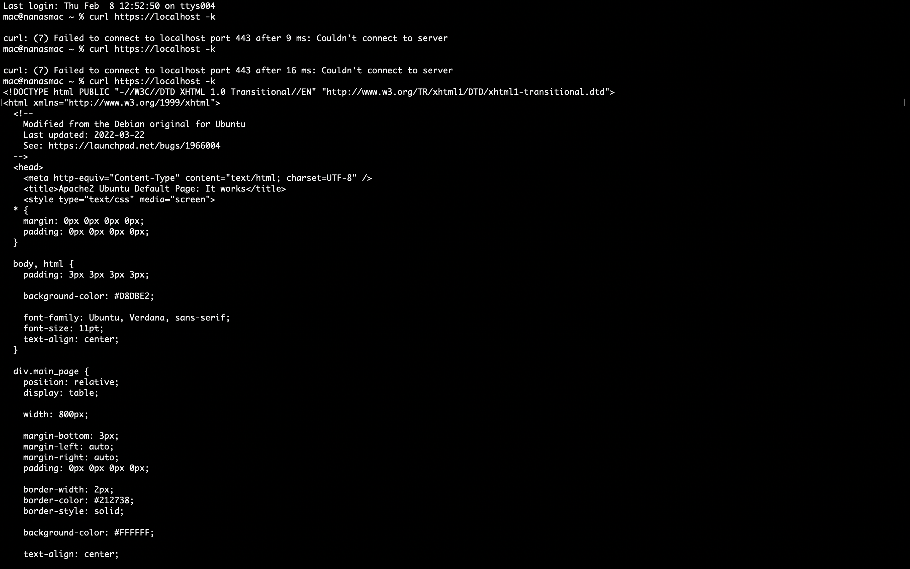
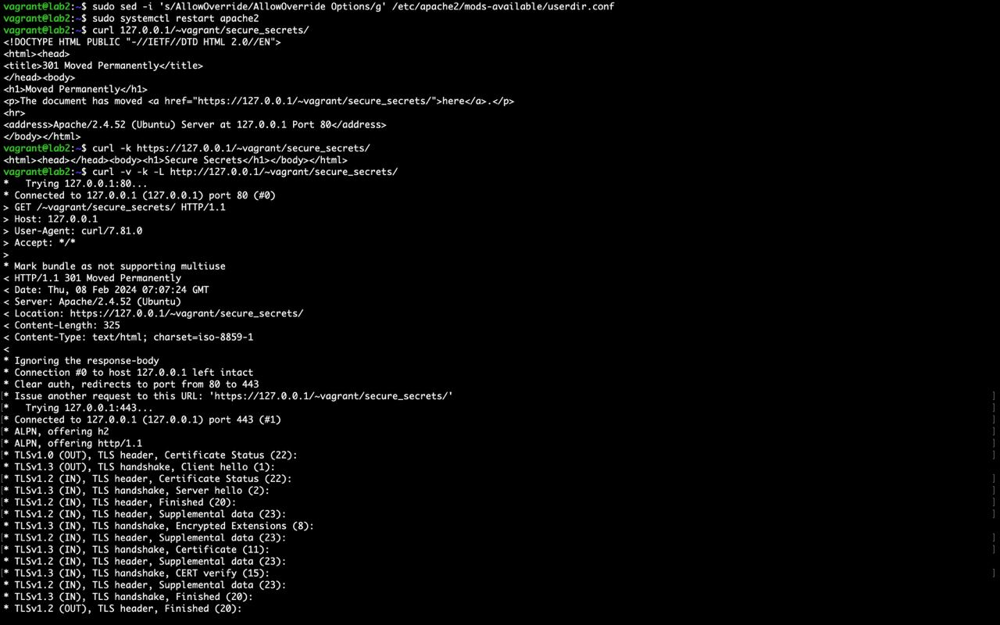
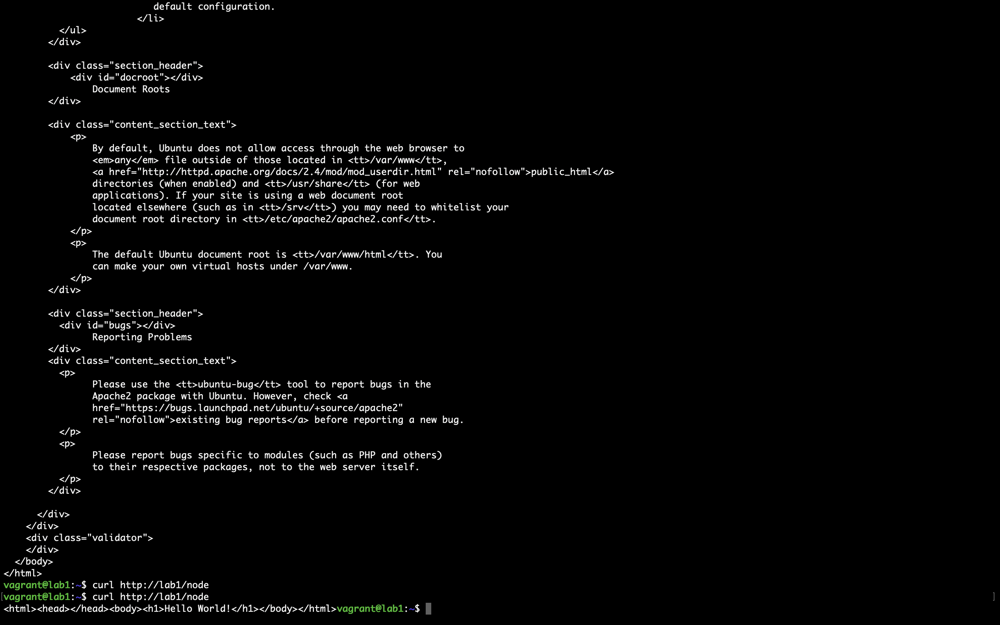

# Question 1

- 1.1 (Do in lab2 terminal)

```bash
systemctl start apache2
curl -s http://localhost
```

- 1.2 (Do in local terminals)

```bash
> ssh -NL 8080:localhost:80 vagrant@127.0.0.1 -p2200
> curl 127.0.0.1:8080
```



# Question 2

- 2.1 (Do all it lab3 terminal)

```bash
node helloworld.js
```


```bash
curl http://127.0.0.1:8080
```



- 2.3

```
Node.js works based on events, using an event loop to handle tasks efficiently. It can do many things at once without waiting, which is called non-blocking I/O. Callbacks are used to handle tasks that take time to complete. Node.js is great for handling lots of connections without using too much computer power. It's fast because it doesn't waste time waiting around. Node.js is perfect for building apps that need to respond quickly and handle many users at once.
```

- Scalability: Because it can handle multiple events simultaneously, an event-driven model can handle a large number of concurrent connections or inputs without becoming bogged down.

- Non-blocking I/O: Node.js uses a non-blocking I/O model, which means that it can perform other tasks while waiting for input or output to be available. This allows Node.js to handle many concurrent connections without having to wait for each one to complete before moving on to the next.

- Asynchronous programming: Node.js uses an asynchronous programming model, which means that it can handle multiple events at the same time without having to wait for one to complete before starting the next. This allows for more efficient use of system resources and can result in faster overall performance.

- Responsive: Node.js is designed to handle multiple connections and perform other tasks while waiting for input or output to be available, which means that it is able to respond quickly to incoming requests or other events.

- Efficient: Event-driven model is ideal when you have many I/O operations happening like in the case of web servers, since the program can handle multiple requests at the same time, without having to wait for one request to complete before starting the next one, which is more efficient.

# Question 3

```
- The first command generates a self-signed SSL certificate and key pair, valid for 365 days, using OpenSSL.
- It creates a private key file (`lab2.key`) and a public key certificate file (`lab2.pem`) in the specified directories.
- The second command appends SSL configuration parameters to the `ssl-params.conf` file for Apache2.
- These parameters specify the SSL cipher suite, protocol versions to allow, and various security headers.
- They ensure secure and modern SSL/TLS configurations for Apache2, mitigating potential security vulnerabilities.
- The configuration enhances security by disabling older SSL/TLS versions, enabling stapling, and setting HTTP security headers like X-Frame-Options and X-Content-Type-Options.
```

- 3.1 (do in local terminal)

```bash
sudo ssh -F vagrant-ssh -L 443:localhost:443 lab2
```


(in another terminal)

```bash
curl https://localhost -k
```



- 3.2

What information can a certificate include? What is necessary for it to work in the context of a web server?
A certificate is a digital document that is used to authenticate the identity of a website or other entity over the internet. A certificate includes information such as the domain name of the website, the name and address of the organization that owns the website, and the name of the certificate authority that issued the certificate. It also includes a public key and a digital signature that can be used to verify the authenticity of the certificate. For a certificate to work in the context of a web server, it must be issued by a trusted certificate authority and it must be installed on the server and properly configured so that it is used for HTTPS connections.

- 3.3

What do PKI and requesting a certificate mean?
PKI (Public Key Infrastructure) is a set of technologies and policies that are used to secure digital communications and transactions by creating a trust infrastructure. A key component of PKI is the use of digital certificates, which are used to authenticate the identity of a website or other entity over the internet. Requesting a certificate means asking a certificate authority (CA) to issue a digital certificate, which is a digital document that contains information about the identity of a website or other entity, along with a public key. The certificate is then used to establish trust between the server and the clients that connect to it. The process of requesting a certificate includes providing the necessary information to the CA, such as the domain name of the website and the name and address of the organization that owns the website, and then verifying that the information is correct and that the organization is authorized to use the domain name.

# Question 4

```bash
chmod 755 ~
sudo a2enmod userdir
sudo a2enmod rewrite
sudo sed -i 's/AllowOverride/AllowOverride Options/g' /etc/apache2/mods-available/userdir.conf
sudo systemctl restart apache2
curl 127.0.0.1/~vagrant/secure_secrets/
curl -k https://127.0.0.1/~vagrant/secure_secrets/
curl -v -k -L http://127.0.0.1/~vagrant/secure_secrets/
curl -k https://127.0.0.1/~vagrant/secure_secrets/s
```

`

1. `sudo a2enmod userdir`:

   - This command enables the `userdir` module in Apache.
   - The `userdir` module allows users to access their home directories via a URL like `http://example.com/~username`.

2. `sudo a2enmod rewrite`:

   - This command enables the `rewrite` module in Apache.
   - The `rewrite` module provides the capability to manipulate URLs during request processing.

3. `sudo sed -i 's/AllowOverride/AllowOverride Options/g' /etc/apache2/mods-available/userdir.conf`:

   - This command uses the `sed` command-line tool to perform a search and replace operation in the `userdir.conf` file.
   - It searches for instances of `AllowOverride` and replaces them with `AllowOverride Options`.
   - The `-i` option instructs `sed` to edit the file in place.

4. `sudo systemctl restart apache2`:
   - This command restarts the Apache HTTP server.
   - It is necessary to restart Apache for the changes made to the configuration to take effect.

modify the `userdir.conf` file to allow certain directives to be overridden in user directories, and then restart Apache to apply the changes. This configuration allows users to access their home directories via the web server and enables URL rewriting capabilities for customizing URL structures.
`

- 4.1
  
  

- 4.2 What is HSTS?
  HSTS (HTTP Strict Transport Security) is a security mechanism that is used to help protect websites against man-in-the-middle (MITM) attacks. It works by telling web browsers that they should only communicate with a website over HTTPS, even if the user types "http://" in the URL bar or clicks on a link that starts with "http://". This helps to prevent attackers from intercepting and modifying the communication between the browser and the website, and can help to protect users from phishing and other types of attacks.

- 4.3

When to use .htaccess? In contrast, when not to use it?

> .htaccess is a configuration file that is used to control how Apache web server behaves for a specific directory and its subdirectories. The .htaccess file is typically used to configure the server for specific functionality, such as setting up redirects, password protection, and custom error pages. It can also be used to configure the server for specific functionality, such as setting up redirects, password protection, and custom error pages.

It's typically used when you don't have access to the main apache configuration or when you have a shared hosting environment.

When not to use it:

> When you have access to the main apache configuration and can make changes there instead.
> When you are dealing with a high traffic website, as .htaccess files may slow down the server and cause performance issues.
> When you have a lot of rules and configurations, it can become hard to manage and test the rules in a .htaccess file.
> When you are using a different web server other than Apache.
> It's important to note that using .htaccess is not always the best option, and it's best to use it in the proper context.The contents of the nginx configuration file are used to configure the behavior of the nginx server. The example above, it's defining a "server" block. Within this block, the first line is the "listen" directive, which tells nginx to listen on port 80 for incoming requests. The second line is the "server_name" directive, which tells nginx to respond to requests for the hostname "lab1".
> Then we have two "location" blocks, one for /apache and one for /node, this blocks define the behavior of the server when a request is made to a specific path. The "proxy_pass" directive in each block tells nginx to forward requests to the specified URL.

# Question 5

- 5.1

```markdown
This `sed` command modifies the `/etc/nginx/nginx.conf` file by adding server blocks and location directives to configure proxying for specific paths to different backend servers. Here's what each part of the command does:

- `sudo sed -i`: Invokes `sed` with superuser privileges (`sudo`) to perform in-place editing of the specified file (`-i`).

- `'s#http {# \`: Starts a `sed` substitution command, replacing occurrences of `http {` with the following multiline block.

- `http { \`: The beginning of the multiline block, indicating the start of the HTTP block in the nginx configuration.

- `server { \`: Defines a new server block within the HTTP block.

- `listen 80; \`: Specifies that this server block listens on port 80.

- `server_name lab1; \`: Sets the server name to `lab1`.

- `location /apache { \`: Defines a location block for requests to the `/apache` path.

  - `rewrite /apache(/|$)(.*) /$2  break; \`: Rewrites requests to remove `/apache` from the URI.

  - `proxy_pass http://lab2:80; \`: Forwards requests to `http://lab2:80` after rewriting.

- `location /node { \`: Defines another location block for requests to the `/node` path.

  - `proxy_pass http://lab3:8080; \`: Forwards requests to `http://lab3:8080`.

- `}#g' /etc/nginx/nginx.conf`: Closes the location and server blocks and completes the `sed` command. The `g` flag ensures global replacement if there are multiple occurrences of `http {`.

In summary, this `sed` command updates the nginx configuration file to include server blocks for handling requests to different paths (`/apache` and `/node`) and proxying them to backend servers (`lab2` and `lab3` respectively).
```

```bash
curl http://lab1/apache
curl http://lab1/node
```



- 5.2

```
The contents of the nginx configuration file are used to configure the behavior of the nginx server. The example above, it's defining a "server" block. Within this block, the first line is the "listen" directive, which tells nginx to listen on port 80 for incoming requests. The second line is the "server_name" directive, which tells nginx to respond to requests for the hostname "lab1".

Then we have two "location" blocks, one for /apache and one for /node, this blocks define the behavior of the server when a request is made to a specific path. The "proxy_pass" directive in each block tells nginx to forward requests to the specified URL.

# http://nginx.org/en/docs/http/ngx_http_upstream_module.html
  The ngx_http_upstream_module module is used to define groups of servers that can be referenced by the proxy_pass. Defines a group of servers.
  The group can be used as load balancers.

# https://nginx.org/en/docs/http/ngx_http_core_module.html#location

Sets configuration depending on a request URI. A location can either be defined by a prefix string, or by a regular expression.

# https://nginx.org/en/docs/http/ngx_http_proxy_module.html#proxy_pass

Sets the protocol and address of a proxied server and an optional URI to which a location should be mapped.

# chang nginx log file

# https://serverfault.com/questions/871305/how-do-you-log-proxy-pass-in-the-nginx-access-log

nginx -t
```

- 5.3

```
The primary purpose of an nginx server is to act as a reverse proxy. It's commonly used as a reverse proxy to handle incoming HTTP and HTTPS requests and forward them to the appropriate backend server, in this case Apache2 and Node.js. This allows nginx to handle tasks such as load balancing, SSL/TLS termination, caching, and serving static files, so that the backend servers can focus on handling the application-specific tasks. Additionally, nginx is highly configurable and can be used for a variety of purposes, such as a reverse proxy, web server, load balancer, and more. It is also known for its high performance and low resource usage, making it a popular choice for high traffic websites and web applications.
```

# Question 6

- 6.1

```bash
nmap -sV -A -sS -p- -T5 --script=http-php-version lab2

Nmap scan report for lab2 (192.168.1.3)
Host is up (0.00077s latency).
Not shown: 65532 closed ports
PORT    STATE SERVICE VERSION
22/tcp  open  ssh     OpenSSH 8.2p1 Ubuntu 4ubuntu0.5 (Ubuntu Linux; protocol 2.0)
80/tcp  open  http    Apache httpd 2.4.41 ((Ubuntu))
|_http-server-header: Apache/2.4.41 (Ubuntu)
|_http-title: Apache2 Ubuntu Default Page: It works
443/tcp open  ssl/ssl Apache httpd (SSL-only mode)
|_http-server-header: Apache/2.4.41 (Ubuntu)
|_http-title: Apache2 Ubuntu Default Page: It works
| ssl-cert: Subject: commonName=\xC3\xA8\xC2\x9Clab2/organizationName=Network/stateOrProvinceName=Espoo/countryName=FI
| Not valid before: 2023-02-03T20:48:12
|_Not valid after:  2024-02-03T20:48:12
| tls-alpn:
|_  http/1.1
MAC Address: 08:00:27:AF:0A:BC (Oracle VirtualBox virtual NIC)
Aggressive OS guesses: Linux 2.6.32 (96%), Linux 3.2 - 4.9 (96%), Linux 2.6.32 - 3.10 (96%), Linux 3.4 - 3.10 (95%), Synology DiskStation Manager 5.2-5644 (95%), Linux 3.1 (95%), Linux 3.2 (95%), AXIS 210A or 211 Network Camera (Linux 2.6.17) (94%), Netgear RAIDiator 4.2.28 (94%), Linux 2.6.32 - 2.6.35 (94%)
No exact OS matches for host (test conditions non-ideal).
Network Distance: 1 hop
Service Info: OS: Linux; CPE: cpe:/o:linux:linux_kernel

TRACEROUTE
HOP RTT     ADDRESS
1   0.77 ms lab2 (192.168.1.3)

OS and Service detection performed. Please report any incorrect results at https://nmap.org/submit/ .
Nmap done: 1 IP address (1 host up) scanned in 29.06 seconds


```

- 6.2

```bash
nikto -h http://lab2
```

```bash
- Nikto v2.1.5

---

- Target IP: 192.168.1.3
- Target Hostname: lab2
- Target Port: 80
- Start Time: 2024-02-08 12:31:54 (GMT0)

---

- Server: Apache/2.4.52 (Ubuntu)
- Server leaks inodes via ETags, header found with file /, fields: 0x29af 0x610b8e33cadef
- The anti-clickjacking X-Frame-Options header is not present.
- No CGI Directories found (use '-C all' to force check all possible dirs)
- Allowed HTTP Methods: HEAD, GET, POST, OPTIONS
```
