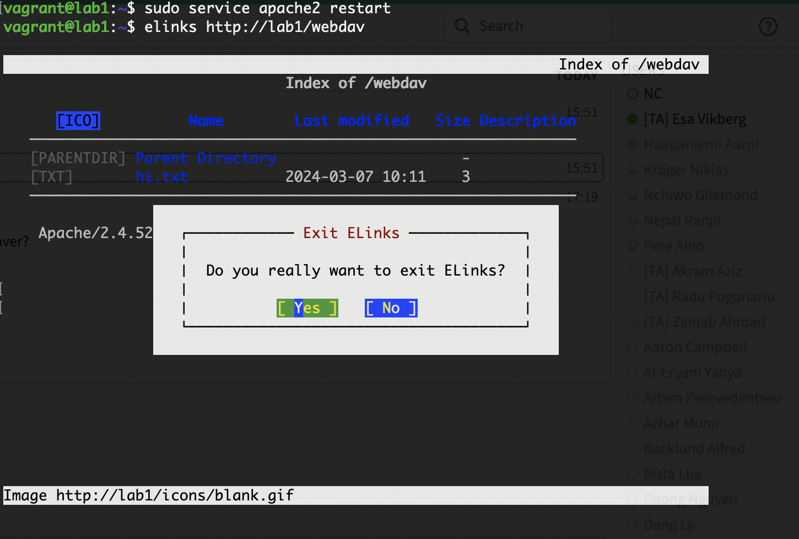

# 2 Configuring and testing NFS

## 2.1 Demonstrate a working configuration.

```bash
sudo -u testuser1 tee /home/testuser1/test.txt <<< "Hello world"
```

```bash
vagrant@lab2:~$ sudo mount -t nfs lab1:/home /mnt
vagrant@lab2:~$ sudo -u testuser1 cat /mnt/testuser1/test.txt

Hello world

vagrant@lab2:~$ sudo umount /mnt
```

## 2.2 Is it possible to encrypt all NFS traffic? How?

> it is possible to encrypt all NFS traffic using the Secure NFS (SNFS) protocol, which provides end-to-end encryption between the client and server. SNFS uses Kerberos v5 for authentication and encryption, and it requires the use of a secure transport protocol such as TCP with SSL or TCP with IPSec. In addition to encryption, SNFS also provides integrity protection for NFS data, preventing tampering or eavesdropping attacks.
> It's important to note that configuring NFS to use TLS encryption can have performance implications, especially if the encryption is performed using software rather than hardware. You should test the performance of your NFS system with and without encryption to determine the impact on performance.

# 3

## 3.1 Demonstrate a working configuration.

```bash
vagrant@lab1:~$ sudo smbpasswd -a testuser1 -s << EOL
123456
123456
EOL
vagrant@lab1:~$ sudo smbpasswd -e testuser1
Enabled user testuser1.
```

```bash
vagrant@lab2:~$ sudo mount -t cifs -o username=testuser1 -o password=123456 //lab1/testuser1 /mnt
vagrant@lab2:~$ cat /mnt/test.txt

Hello world
```

## 3.2 Only root can use mount. What problem does this pose for users trying to access their remote home directories? Is there a workaround for the problem?

> The problem with only allowing root to use mount is that regular users will not be able to mount network filesystems on their own, including their remote home directories. This can be inconvenient and limit their ability to access and work with their files.
> However, there is a workaround for this problem. One way is to add an entry to the /etc/fstab file that specifies the network filesystem and its mount point. This will allow the network filesystem to be mounted at boot time by the system, with the proper permissions for the specified user. Another way is to use the mount command with the suid bit set, which allows users to mount network filesystems as themselves instead of root. However, this method may introduce security risks and is generally not recommended. A third way is to use the "-o" to specify the user and group that should be used to mount the filesystem.

# 4

## 4.1 Provide the commands that you used.

```bash
vagrant@lab2:~$ su testuser1

testuser1@lab2:/home/vagrant$ sshfs testuser1@lab1:/home/testuser1 /home/testuser1/mnt
testuser1@lab2:/home/vagrant$ cd ..
testuser1@lab2:/home$ ls -al testuser1/mnt/
total 36
drwxr-x--- 1 testuser1 testuser1 4096 Mar  7 08:40 .
drwxr-x--- 4 testuser1 testuser1 4096 Mar  7 08:41 ..
-rw------- 1 testuser1 testuser1   57 Mar  7 08:40 .bash_history
-rw-r--r-- 1 testuser1 testuser1  220 Mar  6 14:28 .bash_logout
-rw-r--r-- 1 testuser1 testuser1 3771 Mar  6 14:28 .bashrc
drwx------ 1 testuser1 testuser1 4096 Mar  7 07:45 .cache
-rw-r--r-- 1 testuser1 testuser1  807 Mar  6 14:28 .profile
drwxrwxr-x 1 testuser1 testuser1 4096 Mar  6 14:28 .ssh
-rw-rw-r-- 1 testuser1 testuser1   12 Mar  6 14:28 test.txt

testuser1@lab2:/home$ cat testuser1/mnt/test.txt
Hello world
```

## 4.2 When is sshfs a good solution?

SSHFS is good as a simple, encrypted, file exchange. it operates on top of ssh so it is often allowed through firewalls and those familiar with ssh will find it easy to use. Its also platform independent so good for cross-platform workflows. SSH tie-in allows for single signon eg with -A.

> sshfs can be a good solution in various scenarios where remote access to files is required securely over the SSH protocol. Some examples of when sshfs can be a good solution include:

> Accessing files on a remote server or sharing files between computers: If you need to access files on a remote server, sshfs can provide a secure way to do so over an SSH connection. Remote development: If you are a developer working on a remote server, sshfs can be used to mount the remote project directory on your local machine, allowing you to work on the code locally while the files are stored remotely.

> Accessing cloud storage: If you are using cloud storage services like Amazon S3 or Google Cloud Storage, you can use sshfs to mount the remote storage on your local machine, making it easier to access and manage files. Accessing the filesystem as a normal user instead of root.

> Overall, sshfs can be a good solution when you need to access or share files securely over an SSH connection. It provides a convenient way to mount remote directories as if they were local directories, making it easy to work with files on remote machines.

## 4.3 What are the advantages of FUSE?

```

FUSE (Filesystem in Userspace) has several advantages, including:

Flexibility: FUSE allows developers to create filesystems in userspace without modifying the kernel. This makes it easier to develop and test new filesystems, and it provides greater flexibility for users to customize their filesystems as needed.

Compatibility: FUSE is compatible with a wide range of operating systems, including Linux, macOS, and Windows. This makes it easy to create filesystems that can be used on multiple platforms.

User-level access: FUSE allows users to access filesystems at the user level, which provides greater security and control. Users can mount and unmount filesystems without requiring root access, which reduces the risk of accidental damage or security breaches.

Performance: While FUSE adds an extra layer of abstraction, it has been optimized to provide high performance. FUSE uses a kernel-level caching mechanism to reduce the overhead of accessing files in userspace, which helps to maintain good performance.

Community support: FUSE has a large and active community of developers who are constantly working to improve the technology. This means that there is a wealth of resources available, including documentation, tutorials, and support forums, which makes it easier for developers to create and maintain FUSE filesystems.
```

## 4.4 Why doesn't everyone use encrypted channels for all network filesystems?

```
While encrypted channels can provide additional security for network filesystems, there are several reasons why they are not always used:

Performance: Encryption can add overhead to network filesystem operations, which can slow down the system and reduce performance.
Complexity: Implementing encryption for network filesystems can be complex and may require additional software or hardware.
Compatibility: Encrypted channels may not be supported by all network filesystems or may require specific configuration settings or software to be used.
Convenience: Encrypted channels can make it more difficult to share files and access them from different devices, especially if the devices are not set up to use the same encryption protocols or keys.
```

# 5

## 5.1 Demonstrate a working setup. (View for example a web page on one machine and edit it from another using cadaver).



```bash
vagrant@lab1:~$ cadaver http://lab1/webdav
Authentication required for webdav on server `lab1':
Username: testuser
Password:
dav:/webdav/> ls
Listing collection `/webdav/': succeeded.
        hi.txt                                 3  Mar  7 10:11
dav:/webdav/> edit hi.txt
Locking `hi.txt': succeeded.
Downloading `/webdav/hi.txt' to /tmp/cadaver-edit-MLFwbg.txt
Progress: [=============================>] 100.0% of 3 bytes succeeded.
Running editor: `vi /tmp/cadaver-edit-MLFwbg.txt'...
Changes were made.
Uploading changes to `/webdav/hi.txt'
Progress: [=============================>] 100.0% of 13 bytes succeeded.
Unlocking `hi.txt': succeeded.
dav:/webdav/> cat hi.txt
Displaying `/webdav/hi.txt':
hi, it's me!

```

## 5.2 Demonstrate mounting a WebDAV resource into the local filesystem.

```bash
vagrant@lab2:~$ sudo mount -t davfs http://lab1/webdav ~/mnt/webdav -o username=testuser <<< "123"
  Password:  vagrant@lab2:~$ sudo ls -al ~/mnt/webdav/
total 1
drwxr-xr-x 3 root root 104 Mar  7 10:31 .
-rw-r--r-- 1 root root  13 Mar  7 10:31 hi.txt
drwx------ 2 root root   0 Mar  7 11:01 lost+found

vagrant@lab2:~$ cat ~/mnt/webdav/hi.txt
hi, it's me!

```

## 5.3 Does your implementation support versioning? If not, what should be added?

```
In general, the built-in WebDAV module of Apache2 server platform does not support versioning out of the box.

http://www.webdav.org/specs/rfc3253.html

https://www.webdavsystem.com/server/documentation/creating_deltav/

To enable versioning, we can use a third-party WebDAV server software such as DeltaV that supports versioning or use a versioning file system like ZFS or Btrfs. Alternatively, we can configure a WebDAV server with a version control system like Subversion or Git.

Another option is to use a WebDAV client with built-in versioning support, such as the WebDrive client. This allows us to interact with a WebDAV server and version control system through a single interface.
```

# 6

## 6.1 What is raid? What is parity? Explain raid5?

```
RAID stands for Redundant Array of Independent Disks, which is a method of combining multiple physical hard drives into a single logical unit to improve performance, reliability, and capacity.

Parity is a technique used in RAID to protect data against disk failures. Parity information is generated and stored across multiple drives in the RAID array, allowing the system to rebuild lost data in the event of a disk failure. Parity stores information in each disk.

RAID 5 is a specific type of RAID that uses block-level striping and parity data across multiple drives. It requires a minimum of three disks to implement, and provides a good balance of performance, capacity, and data protection. In RAID 5, data is split into blocks and distributed across all the disks in the array, with parity information stored on a separate disk. If one disk fails, the system can use the parity data to reconstruct the lost data and store it on a replacement disk. However, if two disks fail, data loss can occur, as the system can no longer reconstruct the lost data. RAID 5 is often used in file servers and other applications where data protection is important, but performance and capacity are also key factors.

```

## 6.2 Show that your raid5 solution is working.

```bash
vagrant@lab1:~$ sudo mount /dev/md0 /mnt/nas
vagrant@lab1:~$ sudo mdadm --detail /dev/md0
/dev/md0:
           Version : 1.2
     Creation Time : Thu Mar  7 13:32:44 2024
        Raid Level : raid5
        Array Size : 2093056 (2044.00 MiB 2143.29 MB)
     Used Dev Size : 1046528 (1022.00 MiB 1071.64 MB)
      Raid Devices : 3
     Total Devices : 3
       Persistence : Superblock is persistent

       Update Time : Thu Mar  7 13:41:49 2024
             State : active, degraded, recovering
    Active Devices : 2
   Working Devices : 3
    Failed Devices : 0
     Spare Devices : 1

            Layout : left-symmetric
        Chunk Size : 512K

Consistency Policy : resync

    Rebuild Status : 8% complete

              Name : lab1:0  (local to host lab1)
              UUID : 0de48cb3:8934ccb9:ef354f2c:ebf46fc7
            Events : 9

    Number   Major   Minor   RaidDevice State
       0       8       32        0      active sync   /dev/sdc
       1       8       48        1      active sync   /dev/sdd
       3       8       64        2      spare rebuilding   /dev/sde

```

## 6.3 Access the NAS device from lab2 over NFS

```bash
vagrant@lab2:~$ sudo mount -t nfs lab1:/mnt/nas ~/mnt/nas-client

vagrant@lab2:~$ cat ~/mnt/nas-client/test.txt
Hello, RAID5

```

# 7 Describe briefly a few use cases for samba, nfs, sshfs and WebDAV. Where, why, weaknesses?

- Samba:

Use case: Sharing files and printers between Linux/Unix and Windows machines over a network.
Where: Small to large networks with a mix of Linux/Unix and Windows machines.
Why: Provides seamless file and printer sharing between different operating systems.
Weaknesses: Can be more difficult to set up and configure compared to other solutions, may have performance issues with larger networks.

- NFS:

Use case: Sharing files between Unix/Linux machines over a network.
Where: Unix/Linux networks.
Why: Provides fast, efficient file sharing between Unix/Linux machines.
Weaknesses: May have security concerns, especially when used over an unsecured network. May not be as compatible with other operating systems.

- SSHFS:

Use case: Mounting remote file systems over SSH.
Where: Anywhere with remote servers accessible over SSH.
Why: Provides a secure way to access and manipulate files on remote servers, with the ability to mount remote file systems as if they were local.
Weaknesses: May have performance issues with larger file transfers, may not be as seamless as other solutions for file sharing.

- WebDAV:

Use case: Collaborative editing and management of files on remote web servers based on HTTP
Where: Teams working on shared files and documents.
Why: Provides a way to access and edit files on a web server or other WebDAV client
Weaknesses: May have performance issues with larger file transfers, may not be as secure as other solutions depending on how it is implemented.
